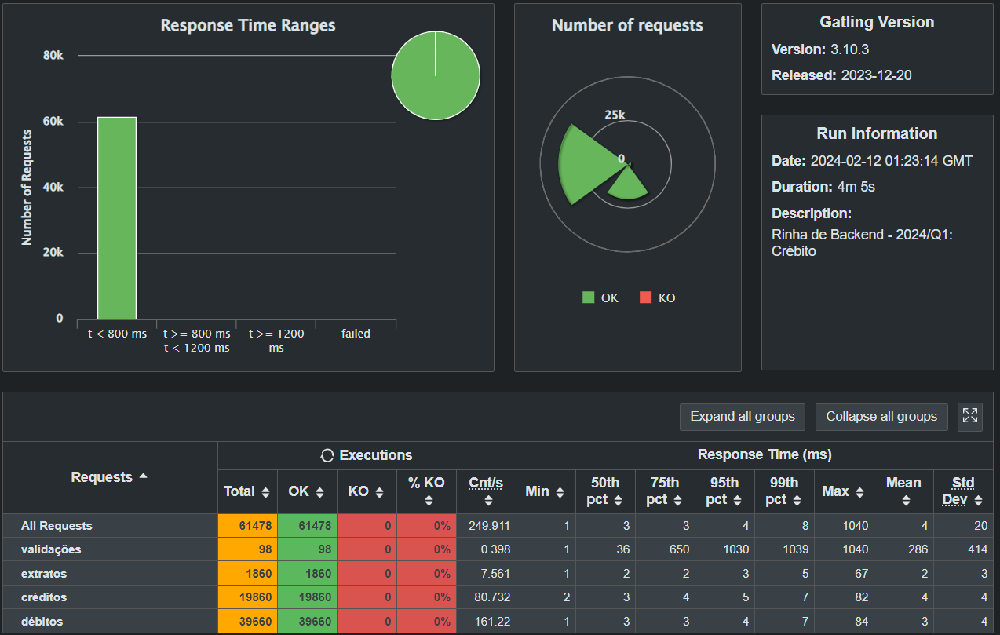

# Rinha de Backend - Segunda Edição

Versão C# da [rinha de backend 2ª edição - 2024/Q1](https://github.com/zanfranceschi/rinha-de-backend-2024-q1)

## Stack

- aspnet 8.0
- nginx
- postgresql

## Rodando o projeto

```bash
docker-compose up -d nginx
```

## Resultados

