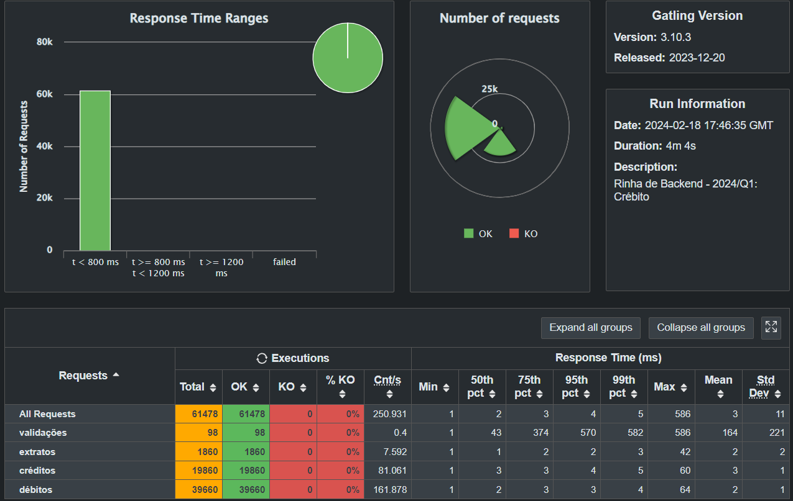

# Rinha de Backend - Segunda Edição

Versão C# da [rinha de backend 2ª edição - 2024/Q1](https://github.com/zanfranceschi/rinha-de-backend-2024-q1)

## Stack

- aspnet 8.0
- nginx
- postgresql

## Rodando o projeto

```bash
docker-compose up -d nginx
```

## Resultados



## Monitoramento

Para monitoramento foi usado o [Prometheus](https://prometheus.io/) e o [Grafana](https://grafana.com/).

```bash
docker-compose up -d grafana
```

2 dashboards foram adicionados criados para acompanhar as métricas da api e do banco de dados. Para acessar o grafana, acesse [http://localhost:3000](http://localhost:3000) com usuário `admin` e senha `admin`.